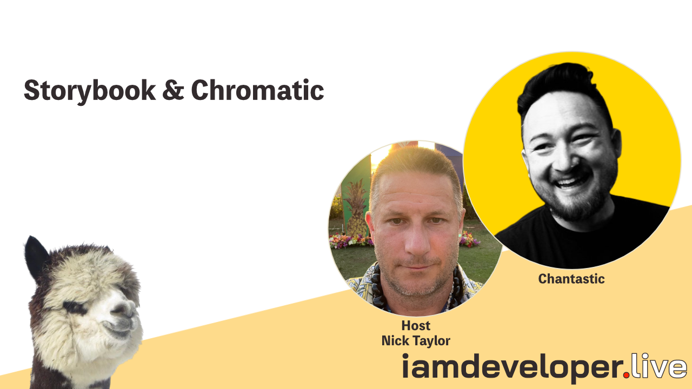

# Storybook and Chromatic from Stream with Chantastic

Michael Chan a.k.a. Chantastic joins Nick Taylor on stream to discuss and live code with [Storybook](https://storybook.js.org) and [Chromatic](https://www.chromatic.com).

This demo project was created by running `npx storybook repro`. (See https://storybook.js.org/docs/react/contribute/how-to-reproduce#initial-setup)

Links:

- Component Story Format (CSF), https://github.com/ComponentDriven/csf
- Stop component testing the hard way — CSF intro, https://www.youtube.com/watch?v=uH9_dfc-6Kc
- Best free Storybook host — embed Stories anywhere!, https://www.youtube.com/watch?v=2tqRpBcV8ug
- Chantastic's Website, https://chan.dev
- Chantastic's Twitter, https://twitter.com/chantastic
- Chantastic's Twitch, https://www.twitch.tv/lunchdev
- Chantastic's YouTube, https://www.youtube.com/c/chantastic
- Chantastic's LinkedIn, https://www.linkedin.com/in/chantastic
- Chantastic's Polywork, https://www.polywork.com/chantastic
